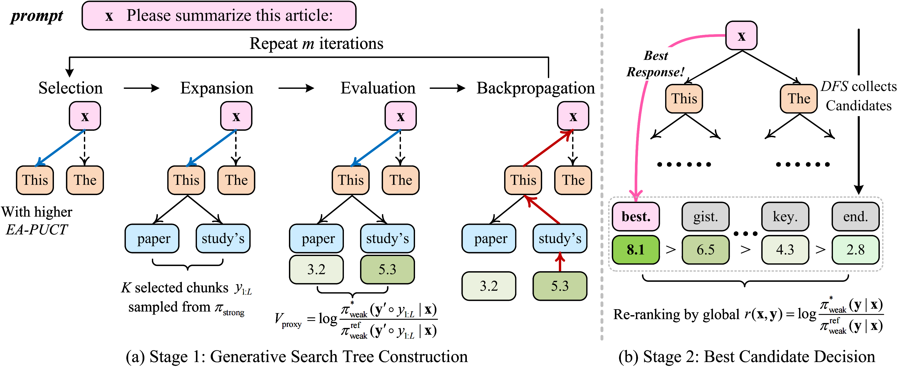

# AAAI 2026 | W2S-AlignTree: Weak-to-Strong Inference-Time Alignment for Large Language Models via Monte Carlo Tree Search

## 📰 News

🎉 **Accepted as Oral at AAAI 2026.**

- Paper on arxiv: [W2S-AlignTree: Weak-to-Strong Inference-Time Alignment for Large Language Models via Monte Carlo Tree Search](xxx).

## 💡 Highlights

 

- **First integration of MCTS with Weak-to-Strong Generalization:** W2S-AlignTree pioneers a plug-and-play inference-time alignment framework that combines Monte Carlo Tree Search with weak-to-strong guidance, enabling dynamic, fine-grained control over strong LLMs without any parameter updates.

- **Entropy-Aware PUCT for adaptive exploration:** Introduces a novel selection rule that incorporates policy entropy to intelligently balance exploration-exploitation, preventing premature convergence and improving trajectory diversity in complex generation spaces.

- **Plug-and-play deployment with weak-model guidance:** Enables immediate alignment of frozen strong LLMs across diverse tasks and model families, achieving superior performance while significantly reducing computational costs through lightweight weak model proxies.

## 🛠️ Installation

```bash
conda create -n w2s_aligntree python=3.10
conda activate w2s_aligntree
pip install -r requirements.txt
```

## 🚀 Quick Run

- The [`controlled_sentiment_generation`] directory contains code for using DPO and SFT gpt2 models (124M) to control larger models to write positive movie reviews.

```bash
cd ./controlled_sentiment_generation
python w2s_aligntree.py
```

## 📖 Citation
